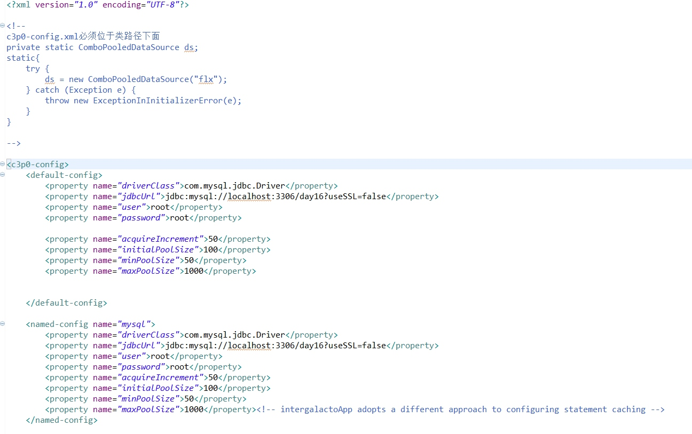

[TOC]
# javaweb
记录javaweb学习过程中的代码
## 说明
该代码暂时从day14开始

## day14_customer
一个关于客户管理的页面，实现使用mysql实现客户的CURD。  
实现了查看客户时的分页功能，并使用自定义EL函数实现字符串超出指定范围时省略号替代。
## day12_upload
文件上传代码，但是不太完善
## day15
内容包括:  
- 向mysql数据库中插入大文本、二进制(图片，视频等)数据。  
    - mysql的大文本数据类型**text**，二进制类型**blob**。(也有别的类型，即类型存储的大，可查API)  
    - 遇到的问题:当对大文本和二进制进行设置时，需要调用`setCharacterStream(int parameterIndex,Reader reader,int length)`方法，还有一个`setCharacterStream(int parameterIndex,Reader reader,long length)`。只不过后者的方法需要在jdk1.6之后才能够使用，但是我在编写时调用了后者，确报出 `java.lang.AbstractMethodError:com.mysql.jdbc.PreparedStatement.setCharacterStream(ILjava/io/Reader;`的错误，进行修改后还是调用该方法，并将第三个参数强转成int类型就好通过了，具体代码可看[Demo1](https://github.com/wangwren/javaweb/blob/master/day15/src/demo/Demo1.java)，[Demo2](https://github.com/wangwren/javaweb/blob/master/day15/src/demo/Demo2.java).该问题原因还不清楚
- 批量处理sql语句
    - statement批处理:
        - 优点:可以向数据库中发送多条不同的sql语句
        - 缺点:
           1. sql语句没有编译
           2. 当向数据库发送多条语句相同，但参数不同的sql语句时需要重复写很多条相同的sql语句
    - preparedstatement批处理:
        - 优点:发送的是预编译后的sql语句，执行效率高
        - 缺点:只能应用在sql语句相同，但参数不同的批处理中。因此此种形式的批处理经常用于在同一个表中批量插入数据或批量更新表的数据。
- 获得数据库自动生成的主键
    - 调用`rs = stmt.getGeneratedKeys()`方法就行，具体看Demo4.
## day16
- 事务:在jdbc中使用事务
    - 当JDBC程序向数据库获得一个`Connection`对象时，默认情况下这个`Connection`对象会自动向数据库提交在它上面发送的SQL语句，若想关闭这种默认提交方式，让多条SQL在一个事务中执行，可使用下列语句:
    - `Connection.setAutoCommit(false);`**相当于数据库中的`start transaction`语句，开启事务**
    - `Connection.rollback();`**相当于数据库中的`rollback`语句，回滚操作，通常设置在`catch`块中**
    - `Connection.commit();`**相当于数据库中的`commit`语句，提交操作**
- 事务实例:比如银行转账，当a向b转账时，如果a转的时候，程序出错，导致a的钱已经扣除，而b的钱还未到帐。使用事务就可以阻止这种事情发生，将两条sql语句编写在一个事务中，如果发生错误，将会回滚，使a的钱也没有扣除  
**详细代码请查看day16 [Demo1](https://github.com/wangwren/javaweb/blob/master/day16/src/day16/Demo1.java)、[Demo2](https://github.com/wangwren/javaweb/blob/master/day16/src/day16/Demo2.java)**  
- 事务的特性:
    - **原子性**:原子性是指事物是一个不可分割的工作单位，事务中的操作要么都发生，要么都不发生。
    - **一致性**:事务必须使数据库从一个一致性状态变换到另一个一致性状态。
    - **隔离性**:事务的隔离性是多个用户并发访问数据库时，数据库为每一个用户开启的事务，不能被其他事务的操作数据所干扰，多个并发事务之间要相互隔离。
    - **持久性**:持久性是指一个事务一旦被提交，它对数据库中数据的改变就是永久性的，接下来即使数据库中数据的改变就是永久性的，接下来即使数据库发生故障也不应该对其有任何影响。  
- 事务的隔离级别:多个线程开启各自事务操作数据库中数据时，数据库系统要负责隔离操作，以保证各个线程在获取数据时的准确性。不考虑隔离性，可能引发的问题:**脏读**、**不可重复读**、**虚读**。
- mysql共定义了四种隔离级别:
    - **Serializable**:可避免脏读、不可重复读、虚读情况发生。设置该种级别性能会降低，在做统计时就可以使用该级别。
    - **Repeatable read**:可以避免脏读、不可重复读情况的发生。
    - **Read committed**:可避免脏读情况发生(读已提交)。
    - **Read uncommitted**:最低级别，以上情况均无法保证。(读未提交)
    - **注意**:Oracle数据库仅支持 **Serializable**、 **Read committed**这两种级别。
- `set transaction isolation level`设置事务隔离级别。(数据库语句)
- `select @@tx_isolation`查询当前事务隔离级别(数据库语句)
- 演示不同隔离级别下的并发问题

1.当把事务的隔离级别设置为read uncommitted时，会引发脏读、不可重复读和虚读


A窗口
```
set transaction isolation level  read uncommitted;
start transaction;
select * from account;
```
-----发现a帐户是1000元，转到b窗口
```
select * from account
```
-----发现a多了100元，这时候a读到了b未提交的数据（脏读）


B窗口
```
start transaction;
update account set money=money+100 where name='aaa';
```
-----不要提交，转到a窗口查询


2.当把事务的隔离级别设置为read committed时，会引发不可重复读和虚读，但避免了脏读

A窗口
```
set transaction isolation level  read committed;
start transaction;
select * from account;
```
-----发现a帐户是1000元，转到b窗口
```
select * from account;
```
-----发现a帐户多了100,这时候，a读到了别的事务提交的数据，两次读取a帐户读到的是不同的结果（不可重复读）


B窗口
```
start transaction;
update account set money=money+100 where name='aaa';
commit;
```
-----转到a窗口


3.当把事务的隔离级别设置为repeatable read(mysql默认级别)时，会引发虚读，但避免了脏读、不可重复读

A窗口
```
set transaction isolation level repeatable read;
start transaction;
select * from account;
```
----发现表有4个记录，转到b窗口
```
select * from account;
```
----可能发现表有5条记如，这时候发生了a读取到另外一个事务插入的数据（虚读）


B窗口
```
start transaction;
insert into account(name,money) values('ggg',1000);
commit;
```
-----转到 a窗口

4.当把事务的隔离级别设置为Serializable时，会避免所有问题
A窗口
```
set transaction isolation level Serializable;
start transaction;
select * from account;
```
-----转到b窗口

B窗口
```
start transaction;
insert into account(name,money) values('ggg',1000);
```
-----发现不能插入，只能等待a结束事务才能插入

- **连接池**:使用数据库连接池优化程序性能。
    - 应用程序直接获取数据库链接的缺点:用户每次请求都需要向数据库获得链接，而数据库创建链接通常需要消耗相对较大的资源，创建时间也较长。假设网站一天10万访问量，数据库服务器就需要创建10万次连接，极大的浪费数据库资源，并极易造成数据库服务器内存溢出。
    - 使用连接池一次性从数据库中获得多个连接，放到连接池中，当用户需要连接时，从连接池中获取链接，并删除连接池中的当前连接，当用户`conn.close()`时，又将该链接放回至连接池中。
    - 编写连接池需实现`java.sql.DataSource`接口。`DataSorce`接口中定义了两个重载的getConnection方法:
        - `Connection getConnection()`
        - `Connection getConnection(String username,String password)`
    - 由于自己编写连接池很麻烦，所以现在很多WEB服务器都提供了`DataSource`的实现，即连接池的实现，也有一些开源组织提供了数据源的独立实现:
        - **DBCP数据库连接池**:应用程序需要导入相关jar包，**注意**dbcp2和dbcp1对jdk版本要求不一样。如果导入的是dbcp2，那么还需要comms-logging包和commons-pool2包，同时mysql的包jar包需要在mysql-connector5.1以上版本，否则运行时会报错。**如果mysql的jar包是5.0.4版本，那么对应的dbcp和pool版本应该为1.4和1.6版本，并且不需要导入logging包**。还需要注意的是，当使用的mysql版本是5.1.44时，**需要在配置文件中的url写成`url=jdbc:mysql://localhost:3306/day16?useSSL=false`**，否则也会出错。
        - 使用配置文件方法，使用dbcp连接池:  
	
                ```
                 static{
		          try{
			         InputStream in = JdbcUtils_DBCP.class.getClassLoader().getResourceAsStream("dbcpconfig.properties");	//读取DBCP的配置文件
			         Properties prop = new Properties();
			         prop.load(in);
			
			         BasicDataSourceFactory factory = new BasicDataSourceFactory();		//创建工厂
			         Datasource ds = factory.createDataSource(prop);
			
		          }catch(Exception e){
			         throw new ExceptionInInitializerError(e);
		              }
	               }
	               //从连接池中获取链接
	               for(int i = 0;i < 20;i++){
	                   Connection conn = ds.getConnection();
	                   System.out.println(conn.hashCode());
	                    if(i % 2){
	                       conn.close();
	                   }
	                }
                ```
      - **C3P0连接池**:同样需要导入相关jar包:`c3p0-0.9.5.2.jar`和`mchange-commons-java-0.2.11.jar`。使用C3P0的配置文件xml文件，可以配置多个数据库连接相关的设置，C3P0连接池也比较常用。使用C3P0代码如下:


配置文件代码:



**DBCP的代码请参照[jdbcUtils_DBCP](https://github.com/wangwren/javaweb/blob/master/day16/src/jdbcutils/JdbcUtils_DBCP.java)**  
**C3P0的代码请参数[jdbcUtils_C3P0](https://github.com/wangwren/javaweb/blob/master/day16/src/jdbcutils/JdbcUtils_C3P0.java)**  
## day17
#### DBUtils使用
- DBUtils:主要是封装了JDBC的代码，简化dao层的操作，DBUtils是由Apache公司提供
- DBUtils三个核心类介绍:
    1. DBUtils:连接数据库对象---jdbc辅助方法的集合类，线程安全。  
       - 构造方法:`DbUtils()`  
       -  作用:控制连接，控制驱动器加载一个类
    2. QueryRunner:sql语句的操作对象，可以设置查询结果集的封装策略，线程安全。  
       - 构造方法:  
            - (1)QueryRunner()创建一个与**数据库无关**的QueryRunner对象，后期再操作数据库的时候，需要手动给一个Connection对象。可手动控制事务,而且需要手动关闭Connection对象。  
            - (2)QueryRunner(DataSource ds)创建一个与**数据库关联**的QueryRunner对象，后期再创建数据库时，不需要Connection对象，自动管理事务。
    3. ResultSetHandle:封装数据的策略对象--将封装结果集中的数据，转换到另一个对象。
ResultSetHandler实现类介绍（由DbUtils框架提供）
  - DbUtils给我们提供了10个ResultSetHandler实现类，分别是：  
     ①ArrayHandler:将查询结果的第一行数据，保存到Object数组中  
      ②ArrayListHandler     将查询的结果，每一行先封装到Object数组中，然后将数据存入List集合  
      ③BeanHandler     将查询结果的第一行数据，封装到user对象  (此处的user是一个封装类)
     ④BeanListHandler     将查询结果的每一行封装到user对象，然后再存入List集合  
     ⑤ColumnListHandler     将查询结果的指定列的数据封装到List集合中  
     ⑥MapHandler     将查询结果的第一行数据封装到map结合（key==列名，value==列值）  
     ⑦MapListHandler     将查询结果的每一行封装到map集合（key==列名，value==列值），再将map集合存入List集合  
     ⑧BeanMapHandler     将查询结果的每一行数据，封装到User对象，再存入mao集合中（key==列名，value==列值）  
     ⑨KeyedHandler     将查询的结果的每一行数据，封装到map1（key==列名，value==列值 ），然后将map1集合（有多个）存入map2集合（只有一个）  
     ⑩ScalarHandler     封装类似count、avg、max、min、sum......函数的执行结果  
     **以上10个ResultSetHandler实现类，常用的是BeanHandler、BeanListHandler和ScalarHandler**  
**详细代码请参照[day17 Demo1](https://github.com/wangwren/javaweb/blob/master/day17/src/vvr/demo/Demo1.java)**  

# ThreadLocal [深入剖析ThreadLocal](http://www.cnblogs.com/dolphin0520/p/3920407.html)
## day17_oracle
#### 使用Oracle数据库处理大数据(二进制数据)
 - Oracle定义了一个BLOB字段用于保存二进制数据。但这个字段并不能存放真正的二进制数据，只能向着个字段存一个指针，然后把数据放到指针所指向的Oracle的LOB段中，LOB段是在数据库内部表的一部分。
 -  因而在操作Oracle的Blob之前，必须获得指针(定位器) 才能进行Blob数据的读取和写入。
 -  可以先使用`insert`语句向表中插入一个空的blob(**调用Oracle的函数`empty_blob()`**)，这将创建一个blob的指针，然后再把这个empty的blob的指针查询出来，这样就可以得到BLOB对象，从而读写blob数据了。
 - 步骤
   1. 插入空blob
```
insert into test(id,image) values(?,empty_blob());
```
   2. 获得blob的cursor
   **注意**:需加`for update`,锁定该行，直至该行被修改完毕，保证不产生并发冲突。
```
select image from test where id=? for update;
BLOB b = rs.getBlob("image");
```
   3. 利用io，获取到的cursor往数据库读写数据  
**注意**:以上操作需开启事务。  
**遇到的问题**:在导入Oracle的驱动时，如果是Oracle database 11g,那么就需要ojdbc6.jar包，否则会报错。  
**具体代码请查看[Demo1](https://github.com/wangwren/javaweb/blob/master/day17_oracle/src/vvr/demo/Demo1.java)**

            
